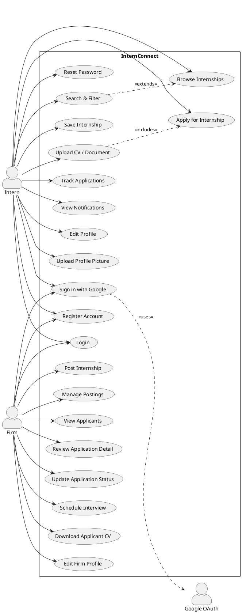
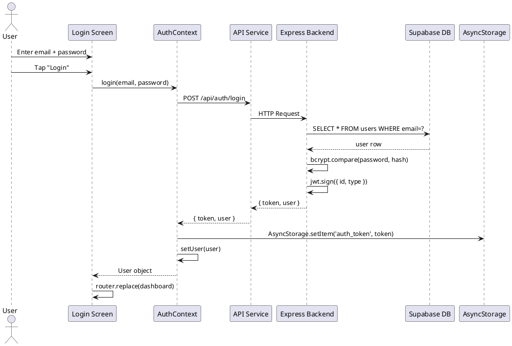
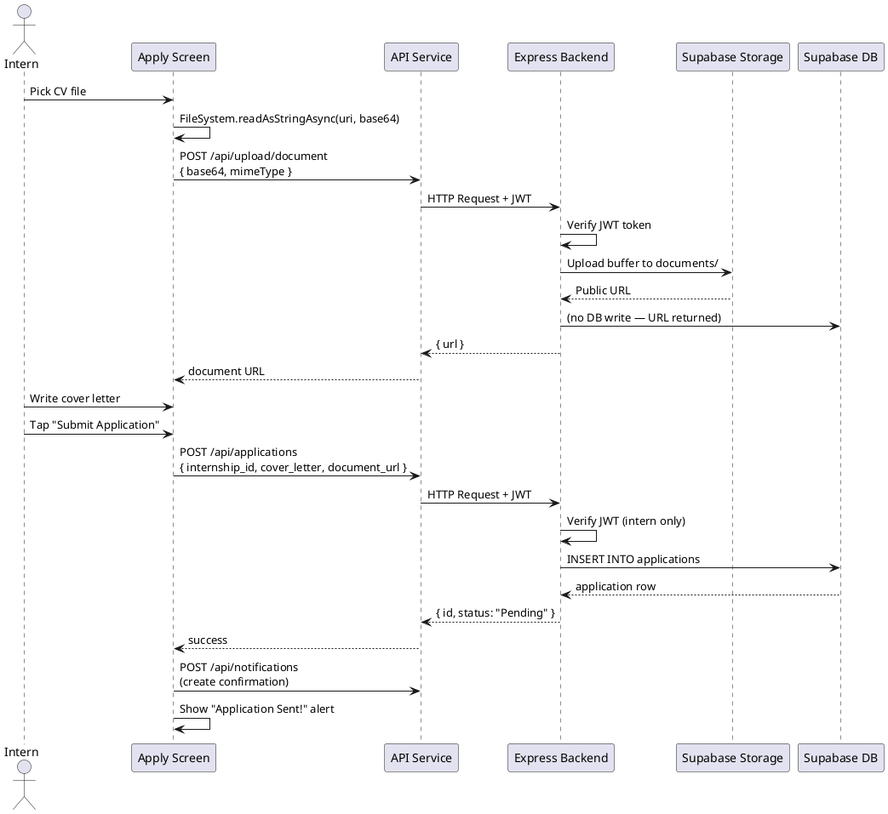
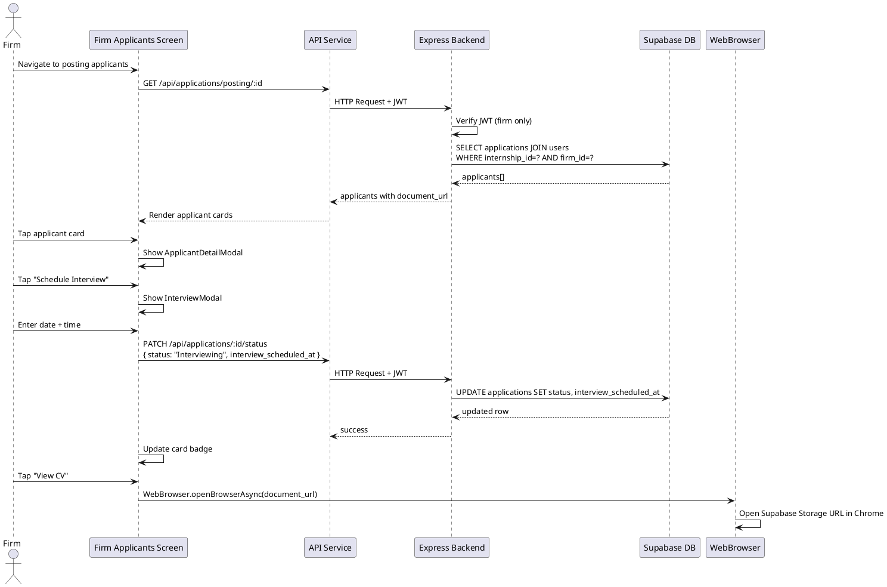
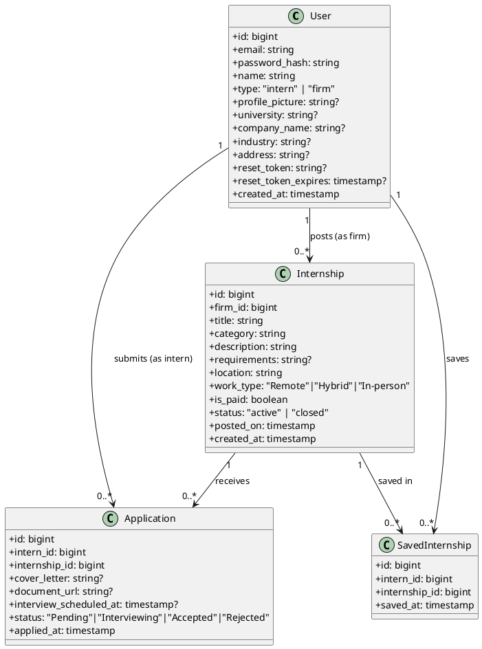
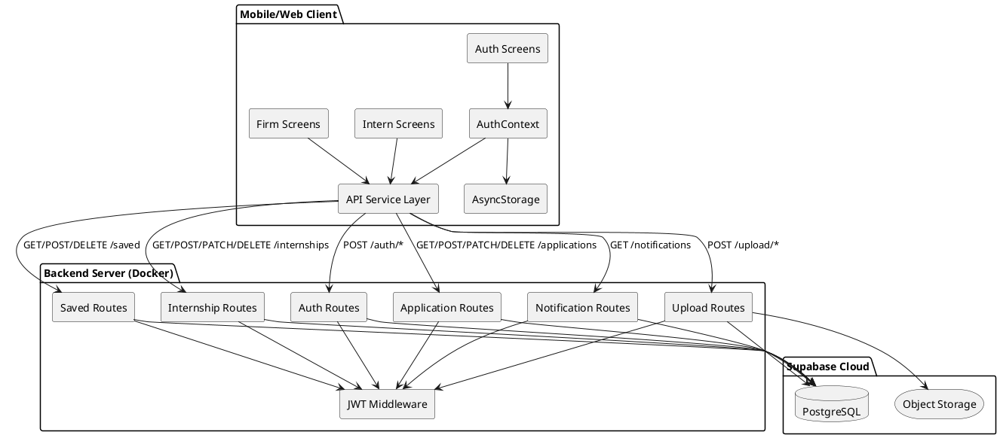
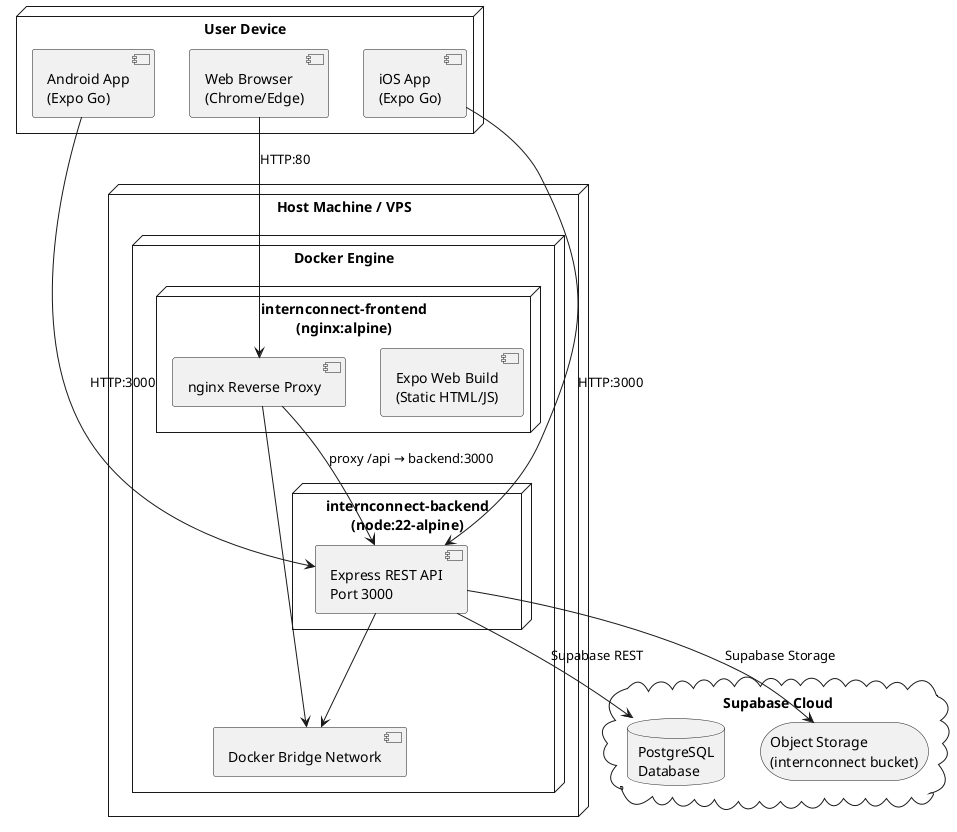

# InternConnect — UML Diagrams
Paste each diagram block into https://plantuml.com/plantuml to generate PNG images for your report.

---

## Diagram 1 — Use Case Diagram

---

## Diagram 2 — Sequence Diagram: User Login

---

## Diagram 3 — Sequence Diagram: Apply for Internship

---

## Diagram 4 — Sequence Diagram: Firm Reviews Applicant

---

## Diagram 5 — Class Diagram (Data Model)

---

## Diagram 6 — Component Diagram

---

## Diagram 7 — Deployment Diagram

---

## How to use these diagrams

1. Go to **https://www.plantuml.com/plantuml/uml/**
2. Paste each `@startuml ... @enduml` block
3. Click Submit → Download PNG
4. Insert PNG into your Word report

**OR** use VS Code extension: `PlantUML` by jebbs — preview and export directly.

**OR** use draw.io (diagrams.net) → Extras → Edit Diagram → paste the PlantUML code.
